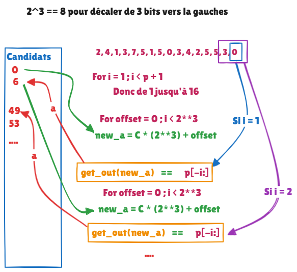

# Jour 17 AOC

# Partie 2 : Recherche du chemin inverse

## Objectif
Trouver A pour que les outputs correspondent au programme initial.


## Principe de fonctionnement et analyse
1. Structure du programme
- Chaque cycle du programme contient 12 étapes (1 cycle = 1 output + pointer go to 0).
- La valeur initiale ``A`` est divisée par environ 8 à chaque cycle (correspondant à un décalage de 3 bits) à chaque étape du cycle.
2. Approche Adoptée :
- Partir de la fin du programme pour reconstruire les candidats possibles pour ``A``.
- Utiliser des décalages de bits (>> pour division par 8) et des masques binaires (& 7 pour modulo 8) pour optimiser les calculs.


## Approche du problème
Je ne sais pas comment faire, j'essai d'analyser le cycle qui revient X * output.length (`` 16 outputs * 12 steps``)
Je pensais faire un brut force en incrémentant la valeur de A et appelé la fonction, tous en breakant le programmme dès qu'une sortie ne correspond plus.
Mais le nombre ``A`` est très important !
<br>
J'ai essayé de décomposer un cycle pour voir comment mon output est impacté en fonction de A.


## Etapes détaillées et approche adoptée

1. Compréhension des cycles
- À chaque étape :
  - A est divisé par 8 : équivalent à un décalage de bits à droite (A >> 3).
  - La sortie (output) est calculée via une opération binaire sur les 3 derniers bits (A & 7).
Ces étapes sont répétées pour chaque instruction du programme.
2. Je dois rechercher ``A``
- Initialisation :
  - On commence par le dernier output de la liste. 
  - Les candidats pour A sont initialisés à [0].
3. Processus itératif :
- Pour chaque ``output``, je dois explorer toutes les combinaisons possibles de A (en tenant compte des 3 derniers bits) et tester leur validité.
- Valider les candidats en comparant les sorties générées avec celles attendues.
- Passer au cycle précédent en recalculant les valeurs de A possibles.

4. Optimisations
- Remplacer les opérations coûteuses comme le % et les divisions par des décalages et des masques binaires :
  - x % 8 → x & 7
  - a // (2 ** b) → a >> b
- Cela améliore la performance lors de l'exploration exhaustive des candidats.
- Cela s'appelle les opérateurs [bitwise](https://wiki.python.org/moin/BitwiseOperators)

## Illustation



## Recherche pratique
Exemple script fonctionnel :
<br>
Mon programme : ``[2, 4, 1, 3, 7, 5, 1, 5, 0, 3, 4, 2, 5, 5, 3, 0]``
<br>
```terminal
------
Pour [0]
Candidat : 0
A valid pour [0] == [0] -> 6
------
Pour [3, 0]
Candidat : 6
A valid pour [3, 0] == [3, 0] -> 49
A valid pour [3, 0] == [3, 0] -> 53
------
Pour [5, 3, 0]
Candidat : 49
A valid pour [5, 3, 0] == [5, 3, 0] -> 393
A valid pour [5, 3, 0] == [5, 3, 0] -> 397
Candidat : 53
A valid pour [5, 3, 0] == [5, 3, 0] -> 425
A valid pour [5, 3, 0] == [5, 3, 0] -> 429
A valid pour [5, 3, 0] == [5, 3, 0] -> 430
------
Pour [5, 5, 3, 0]
Candidat : 393
A valid pour [5, 5, 3, 0] == [5, 5, 3, 0] -> 3145
A valid pour [5, 5, 3, 0] == [5, 5, 3, 0] -> 3151
Candidat : 397
A valid pour [5, 5, 3, 0] == [5, 5, 3, 0] -> 3177
Candidat : 425
A valid pour [5, 5, 3, 0] == [5, 5, 3, 0] -> 3401
A valid pour [5, 5, 3, 0] == [5, 5, 3, 0] -> 3407
Candidat : 429
A valid pour [5, 5, 3, 0] == [5, 5, 3, 0] -> 3433
Candidat : 430
A valid pour [5, 5, 3, 0] == [5, 5, 3, 0] -> 3442
------
etc...
```

# Conclusion
<b><u>Approche principale :</u></b>
- Partir de la fin des sorties pour remonter les cycles.
- Explorer les candidats possibles pour A en utilisant des décalages de bits.
- Valider chaque candidat en générant les sorties correspondantes.
<br>
<b><u>Points à approfondir :</u></b>
- Approfondir les notions de manipulations binaires (opérateurs & et >>).
- Étudier des méthodes pour réduire encore l'espace de recherche (heuristiques ou optimisations supplémentaires).