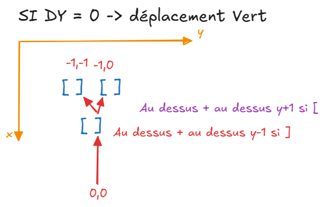

# Jour 15 AOC

Déplacement d'un joueur sur une grille, il a la possibilité de pousser des boites.

Code python : [srcp/day-15.py](https://github.com/math-dev-24/aoc-2024-ts-rust/blob/main/srcp/day-15.py)

## Réflexion
- utiliser des fonctions récursives pour pousser les boites.
- avant de pousser vérifier tous ce qu'il y a dérièrer jusqu'à un vide ou mur.
- Partie 2 : les box font de 2 large donc prévoir cas spécifique pour pousser sur l'axe X.

