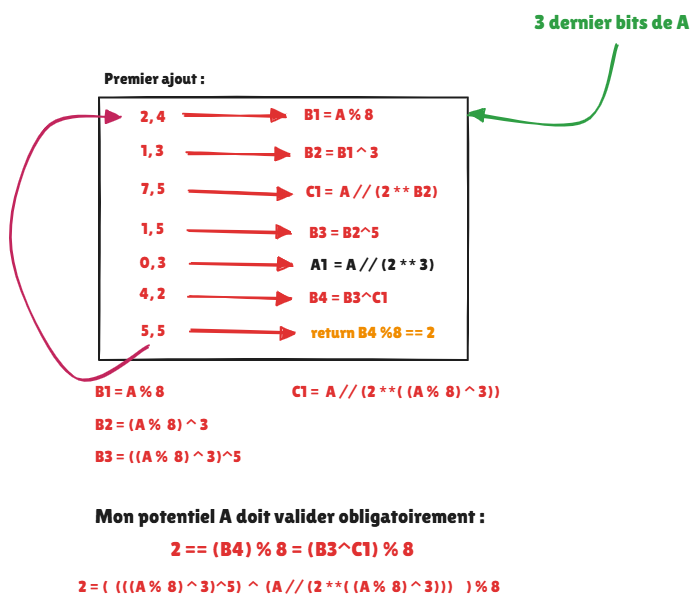

# Jour 17 AOC

## Analyse
- extraction des valeurs
- extraction des registres

## Recherche
- je regarde ce qu'il se passe juste sur le premier output
- Je cherche à obtenir un output == 2
- Donc je peux trouver les A potentiels pour lesquels le output est 2

